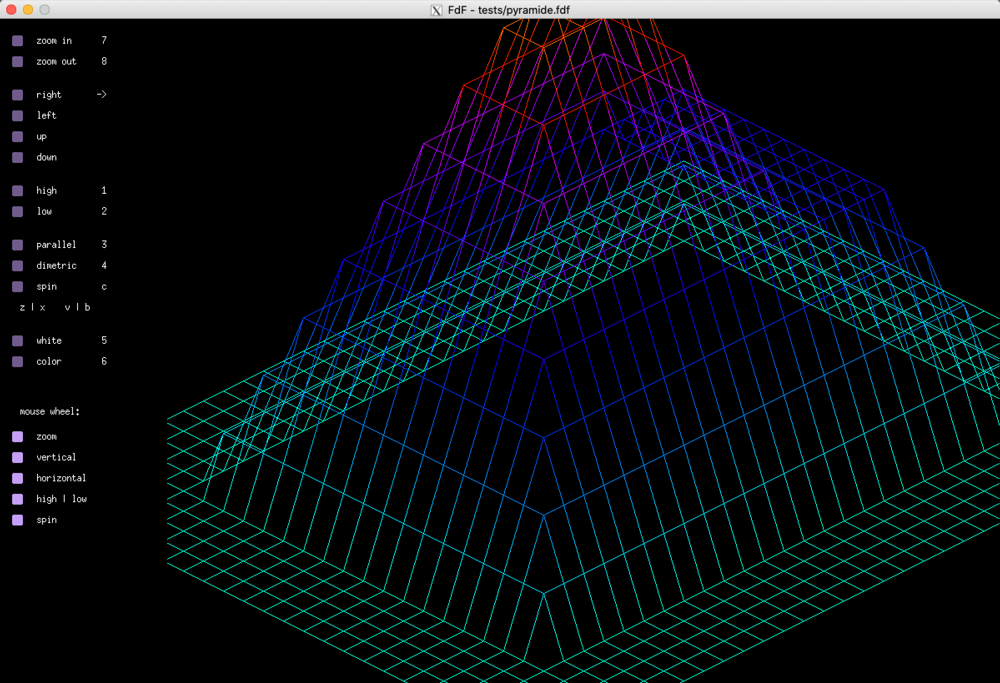
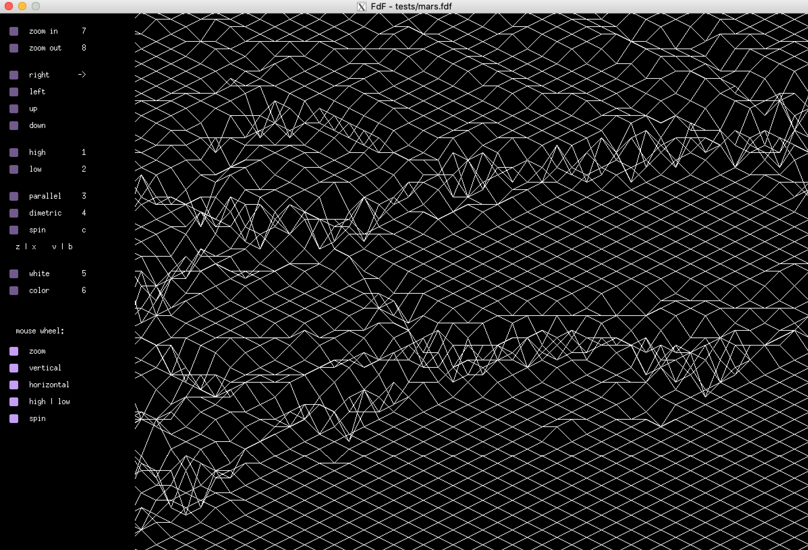

# FdF

- a Hive Helsinki school project FdF.

- this project is about creating a simplified graphic “wireframe” (“fils de fer” in french,
hence the name of the project) representation of a relief landscape linking various points
(x, y, z) via segments.

		make && ./fdf tests/[map]

